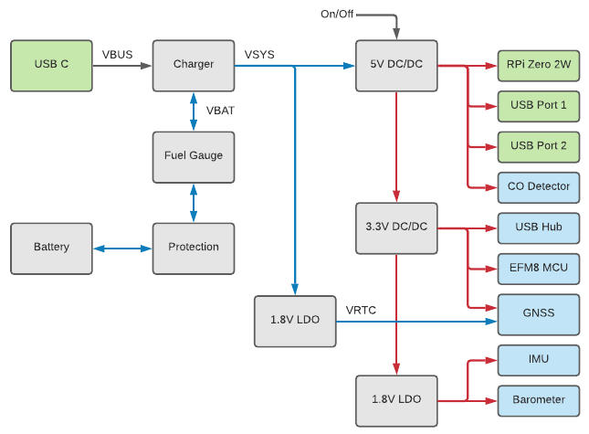

# Stratux Zero

Portable ADS-B/Flarm/OGN traffic receiver, AHRS, GNSS, pressure altitude and CO-alarm based on the Stratux project and a Raspberry Pi Zero 2.

The Flarm/OGN can be reconfigured for 978 MHz UAT for non-European use.

This project is based on the great work of:
- [Stratux (cyoung/stratux)](https://github.com/cyoung/stratux)
- [Stratux - European edition (b3nn0/stratux)](https://github.com/b3nn0/stratux)

Read more about the Stratux project at [stratux.me](http://stratux.me/) and at [dross:aviation](https://dross.net/aviation/).

Note that this does not replace any primary systems and should only be used as a complement for increased safety and situational awareness.

> THE SOFTWARE IS PROVIDED “AS IS”, WITHOUT WARRANTY OF ANY KIND, EXPRESS OR IMPLIED, INCLUDING BUT NOT LIMITED TO THE WARRANTIES OF MERCHANTABILITY, FITNESS FOR A PARTICULAR PURPOSE AND NONINFRINGEMENT.

## Features

- Dual USB 2.0 receptacles for [NooElec NESDR Nano 2+](https://www.nooelec.com/store/nesdr-nano2.html) or similar, [Microchip USB2512](https://www.microchip.com/en-us/product/USB2512)
- Pressure altimeter, [Bosch BMP280](https://www.bosch-sensortec.com/products/environmental-sensors/pressure-sensors/bmp280/)
- 9-axis motion tracking, [TDK ICM-20948](https://invensense.tdk.com/products/motion-tracking/9-axis/icm-20948/)
- GNSS (GPS, Galileo, GLONASS, BeiDou) with 2.5 m CEP accuracy, [u-blox CAM-M8Q](https://www.u-blox.com/en/product/cam-m8-series)
- GNSS backup power for faster initial lock
- Carbon monoxide detector with 85 dB audible alarm, [SGX MICS-4514](https://sgx.cdistore.com/products/detail/mics4514-sgx-sensortech/333417/)
- 18650 battery socket
- 4.2 V overvoltage, 2.5 V undervoltage and over-current protection, [TI BQ2972](https://www.ti.com/product/BQ2972)
- USB C power with built-in 1 A charger (can be set up to 3.15 A with a resistor change), with support for USB BC1.2, Apple, Samsung and legacy USB charge adapters, [Maxim MAX77751](https://www.maximintegrated.com/en/products/power/battery-management/MAX77751.html)
- High temperature and low temperature charge monitoring
- Fuel gauge that monitors the battery state of charge and aging, [TI BQ27441](https://www.ti.com/product/BQ27441-G1)
- Hard/soft power switch that first signals the Raspberry to shutdown cleanly and if that takes to long, power will be cut
- Optimized fo a Raspberry Pi Zero 2
- Watchdog that resets the Raspberry Pi if it has stopped
- Starts in about 11 seconds
- Five LED indicators
    - Green power indicator that flashes if low battery
    - Green Stratux status indicator that flashes if starting up or shutting down
    - Red carbon monoxide alert that flashes every 5 seconds if detected
    - Green external power indicator
    - Orange charge indicator that flashes while charging and turned on when fully charged

The CO-alarm, watchdog, charging temperature monitoring, battery and power management is handled by an [Silicon Labs EFM8BB10 8051 MCU](https://www.silabs.com/mcu/8-bit-microcontrollers/efm8-busy-bee/device.efm8bb10f4g-qfn20).

## Contents of this repository

- CAD and CAM files for the custom PCBs
- CAD files for the enclosure
- Source code for the EFM8 firmware
- Source code for the [monitoring](src/gpio-status) and [shutdown](src/gpio-shutdown) service for the Raspberry Pi
- [Hashicorp Packer](https://www.packer.io/) build files and instructions on creating the Raspberry Pi image file

## Design decisions

Because of the global component shortage, many of the components are selected out of availability. This leads to a more expensive design with several difficult component footprints.
Still, several of the components are impossible to acquire separatly and may need to be desoldered from various break-out and development kits.

The integrated 1090 MHz antenna for ADS-B data is a simple dipole design. This however, requires a balun with impedence matching which is located on a separate PCB.

### Ideas for improvements

- Add a USB power delivery switch to the external ports so that they can
  be switched off when the unit it charging while Raspberry Pi is not started.
  For example, using a [TI TPS2001D](https://www.ti.com/product/TPS2001D).
- Add a third power switch position that would start the unit whenever there is
  external power. Good for when having the unit installed in the aircraft.
  This can be done by implementing a voltage divider that can be sampled by the MCU.
- Add pin header for a fan that can be controlled from GPIO4.

### Power management



There is a DC/DC regulator that takes power from the battery or external USB-C and outputs the main 5 V bus. This bus powers the Raspberry Pi through the GPIO and provides power to the two USB A connectors.

From the 5 V, a 3.3 V and 1.8 V is created to power various circuitry.

The 5 V regulator can be enabled from three sources.

- The physical power switch will always keep the 5 V enabled.
- When external power is provided on the USB-C. However, the EFM8 will keep the Raspberry Pi from starting using the RUN-pin if the physical power switch is in off.
- The EFM8 can keep the 5 V on to allow the Raspberry Pi to power down cleanly.

An additional 1.8 V is created from the battery to provide a backup power to the u-blox CAM-M8Q to allow for a faster startup and satellite lock.

Multiple test points can be found on the backside of the PCB.

## Building the Stratux Zero image

These instructions are written for a AMD64 Ubuntu Linux environment and can be run in Windows 10 WSL 2.

### Prerequisites

Install all required components for compiling and building the Raspberry Pi Zero 2 disk image.

Pulling the optional [Drewsif/PiShrink](https://github.com/Drewsif/PiShrink) submodule allows the finished image to be shrunk, making the flashing faster.

**Install required packages:**

```bash
sudo apt-get install git unzip qemu-user-static e2fsprogs dosfstools libarchive-tools jq
```

**Install Packer:**

```bash
curl -fsSL https://apt.releases.hashicorp.com/gpg | sudo apt-key add -
sudo apt-add-repository "deb [arch=amd64] https://apt.releases.hashicorp.com $(lsb_release -cs) main"
sudo apt-get update && sudo apt-get install packer
```

**Install Go if missing:**

```bash
wget -c https://go.dev/dl/go1.17.6.linux-amd64.tar.gz -O - | sudo tar -xz -C /usr/local
export PATH=$PATH:/usr/local/go/bin
echo 'export PATH=$PATH:/usr/local/go/bin' | sudo tee /etc/profile.d/go_path.sh
```

**Build and install packer-builder-arm plugin:**

```bash
git clone https://github.com/mkaczanowski/packer-builder-arm
cd packer-builder-arm
go mod download
go build
sudo mv packer-builder-arm $(dirname $(which packer))
cd ../
rm -Rf packer-builder-arm
```

### Building the image

The build is done using [Hashicorp Packer](https://www.packer.io/) and [a plugin for emulating the ARM architecture using QEMU](https://github.com/mkaczanowski/packer-builder-arm).

```bash
sudo packer build src/stratux-zero-image
```

The build will take around 20 to 45 minutes and will result in a file named `"stratux-zero-raspios-arm64.img"`.
This file can be flashed to an SD card using [Etcher](https://www.balena.io/etcher/) or similar software.

### Customizing

The image can be customized by passing variables into the `packer build`.

To enable SSH access, run:

```bash
sudo packer build -var enable_ssh=true src/stratux-zero-image
```

> If you plan on enabling SSH, it is also a good idea to change `raspios_username` and `raspios_password`.

To enable developer mode, run:

```bash
sudo packer build -var enable_developer_mode=true src/stratux-zero-image
```

The `-var` can be used multiple times and variables can also be passed as a configuration file or as environment variables.

For a full list of variables and default values, see the [variables.pkr.hcl](src/stratux-zero-image/variables.pkr.hcl).

## Building the EFM8 firmware

The onboard 8051 microcontroller requires [Silicon Labs Simplicity Studio](https://www.silabs.com/developers/simplicity-studio) for compiling and flashing the firmware.

To program the board you will need a [Silicon Labs USB Debug Adapter](https://www.silabs.com/development-tools/mcu/8-bit/8-bit-usb-debug-adapter) and a [TC2030-IDC 6-pin Tag-Connect cable](https://www.tag-connect.com/product/tc2030-idc-6-pin-tag-connect-plug-of-nails-spring-pin-cable-with-legs).
